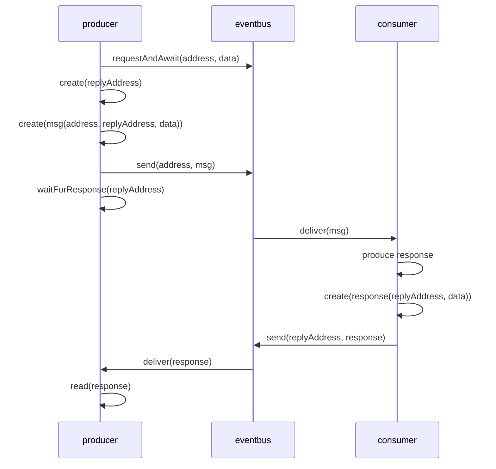

```mermaid
sequenceDiagram
    participant producer
    participant eventbus
    participant consumer
    producer->>eventbus: requestAndAwait(address, data)
    producer->>producer: create(replyAddress)
    producer->>producer: create(msg(address, replyAddress, data))
    producer->>eventbus: send(address, msg)
    producer->>producer: waitForResponse(replyAddress)
    eventbus->>consumer: deliver(msg)
    consumer->>consumer: produce response
    consumer->>consumer: create(response(replyAddress, data))
    consumer->>eventbus: send(replyAddress, response)
    eventbus->>producer: deliver(response)
    producer->>producer: read(response)
```
